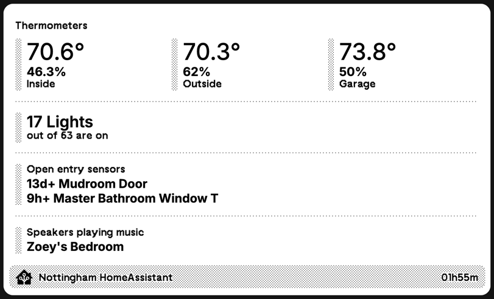

# ha2trmnl

This tool is the backend of a Private TRMNL plugin. It is very simple:

- Call the HomeAssistant entity API to get all entities
- Call the HomeAssistant websocket API to get all labels assigned in the UI
- Compute some metrics/aggregates based on entity states
- Send a simple JSON payloads to a TRMNL webhook for a Private Plugin

I added a `Dockerfile` that wraps this script to run it in a container as a CronJob.

This is an example payload of what it sends to TRMNL:

```json
{
  "merge_variables": {
    "generated": "17h13m",
    "lights": {
      "off": 31,
      "on": 32,
      "percent_on": 50.79365079365079
    },
    "metrics": {
      "humidity": {
        "garage": 50,
        "inside": 49.279999999999994,
        "outside": 59
      },
      "temperature": {
        "garage": 81,
        "inside": 68.86999999999999,
        "outside": 75.7
      }
    },
    "open_sensors": [
      "12d+ Mudroom Door",
      "5h+ Master Bathroom Window T"
    ],
    "speakers_playing":  [
      "Office"
    ]
  }
}
```

Using this [markup.html](examples/markup.html), we get this nice plugin:



***This script is very customized to my needs and my HA setup. I expect the best use case for this repo will be an example and inspiration for others to build their own private plugins.***

## Setup

First, make a new [Private Plugin](https://docs.usetrmnl.com/go/private-plugins/templates):

- Use the Webhook strategy
- Copy the webhook URL (you need it for the config later)
- Edit the markup for the plugin. Here's an example: [markup.html](examples/markup.html)

Next, create config file, like what's in [example_config.yaml](examples/example_config.yaml)

Then, run this tool with docker compose:

```yaml
version: "3.8"

services:
  ha2trmnl:
    image: fisherevans/ha2trmnl:latest
    restart: unless-stopped
    environment:
      CRON_SCHEDULE: "*/5 * * * *"
      TZ: "America/New_York"
    volumes:
      - /path/to/your/ha2trmnl_config.yaml:/config/config.yaml:ro
```

## Developing

- `go run ./cmd/ha2trmnl` to run the tool locally based on the source code
- `./build.sh` will build a new docker image locally
- `./run_docker.sh` will run the local docker image with a once-per-minute CRON schedule
- `./publish.sh` will publish the docker image (only I can, haha)